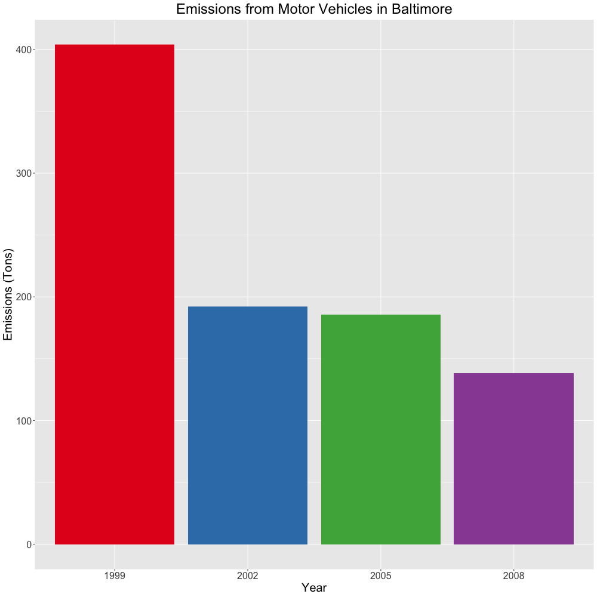

### Exploratory Data Analysis Project 2 - Fine Particulate Matter:

*Author: Alexander M Fisher*  

 **********
 
This is the second course project for the Exploratory Data Analysis module apart of the Coursera Data Science Specialization. Included in this repository are the r scripts `plot1.R`, `plot2.R`, `plot3.R`, ... , and their corresponding output .png files with the same respective names. The `data` directory is also included in this repository which contains the relevant data files `Source_Classification_Code.rds` and `summarySCC_PM25.rds`. 

**********

#### Data:

[Fine Particulate Matter Data](https://d396qusza40orc.cloudfront.net/exdata%2Fdata%2FNEI_data.zip) [29Mb]

**********

#### Files:

- `data/Source_Classification_Code.rds`: dataset containing categorical info. on each observation.
- `data/summarySCC_PM25.rds`: main dataset (included emissions data) used for creating plots.
- `plot1.R`: script that produced `plot1.png`
- `plot2.R`: script that produced `plot2.png`
- `plot3.R`: script that produced `plot3.png`
- `plot4.R`: script that produced `plot4.png`
- `plot5.R`: script that produced `plot5.png`
- `plot6.R`: script that produced `plot6.png`
- `plot1.png`: total emissions for each year
- `plot2.png`: total emissions for each year just in Baltimore
- `plot3.png`: total emissions in Baltimore for each year faceted by type
- `plot4.png`: coal combustion related emissions in Baltomore for each year
- `plot5.png`: motor vehicle emissions in Baltimore for each year
- `plot6.png`: same as plot five but included Los Angeles faceted for comparison.

**********

#### Code and Resulting Plots:

##### plot1:

```r
# load data (summarySCC_PM25.rds data file stored in "data" directory):
NEI <- data.table::as.data.table(readRDS("./data/summarySCC_PM25.rds"))

# sum over years to calculate total emissions over year:
total_Emissions <- NEI[, lapply(.SD,sum,na.rm=TRUE),.SDcols = c("Emissions"), by = "year"]

# plot result in barplot:
png("plot1.png", width=480, height=480)
options(scipen=10)
barplot(height = total_Emissions[[2]], names.arg = total_Emissions[[1]], 
        xlab = "Years", 
        ylab = "Emissions (Tons)",
        main = "Emissions for each Year")
dev.off()
```


##### plot2:

```r
# load data:
NEI <- data.table::as.data.table(readRDS("./data/summarySCC_PM25.rds"))

# generate table by summing over years:
total_Emissions = subset(NEI,fips == "24510")
total_Emissions = total_Emissions[, lapply(.SD,sum,na.rm=TRUE),.SDcols=c("Emissions"),by=c("year")]

# plot result in barplot: 
png("plot2.png", width=480, height=480)
options(scipen=10)
barplot(total_Emissions[[2]], names = total_Emissions[[1]], xlab = "Years", 
        ylab = "Emissions (Tons)",
        main = "Emissions for each Year in Baltimore City")
dev.off()
```


##### plot3:

```r
library(ggplot2)

# load data:
NEI <- readRDS("./data/summarySCC_PM25.rds")
baltimore_emissions_dt <- subset(NEI,fips=="24510")

# plot:
png("plot3.png", width=1000, height=1000)
plot <- ggplot(baltimore_emissions_dt, aes(x = factor(year), y = Emissions)) +
        geom_bar(aes(fill = type), stat="identity") + guides(fill=FALSE) + 
        facet_grid(.~type) + scale_fill_brewer(palette="Set1") +
        labs(x="Year",y="Emissions (Tons)",title="Emissions in Baltimore by Type") +
        theme(plot.title = element_text(hjust = 0.5),text = element_text(size=20))
print(plot)
dev.off()
```


##### plot4:

```r
library(ggplot2)

# load data:
NEI <- readRDS("./data/summarySCC_PM25.rds")
SCC <- readRDS("./data/Source_Classification_Code.rds")

# find coal combustion related obs.
combust_related <- grepl("Comb", SCC$Short.Name)
coal_related <- grepl("Coal", SCC$Short.Name)
coal_combust_SCC <- SCC[combust_related & coal_related,"SCC"]
coal_combust_NEI <- NEI[NEI$SCC %in% coal_combust_SCC,]

# plot:
png("plot4.png", width=1000, height=1000)
options(scipen=10)
plot <- ggplot(coal_combust_NEI, aes(x = factor(year), y = Emissions)) +
        geom_bar(aes(fill = factor(year)),stat="identity") + guides(fill=FALSE) +
        scale_fill_brewer(palette="Set1") +
        labs(x="Year",y="Emissions (Tons)",title="Emissions (Coal Combustion-related)") +
        theme(plot.title = element_text(hjust = 0.5),text = element_text(size=20))
print(plot)
dev.off()
```


##### plot5:

```r
# load data:
NEI <- readRDS("./data/summarySCC_PM25.rds")
SCC <- readRDS("./data/Source_Classification_Code.rds")

# find vehicle related obs this includes on road and off road vehicles.
vehicle_related <- grepl("Vehicle", SCC$SCC.Level.Two)
vehicle_SCC <- SCC[vehicle_related,"SCC"]
vehicle_NEI <- NEI[NEI$SCC %in% vehicle_SCC,]
balitmore_vehicle_NEI = subset(vehicle_NEI,fips == "24510")

# plot:
png("plot5.png", width=1000, height=1000)
options(scipen=10)
plot <- ggplot(balitmore_vehicle_NEI, aes(x = factor(year), y = Emissions)) +
        geom_bar(aes(fill = factor(year)),stat="identity") + guides(fill=FALSE) +
        scale_fill_brewer(palette="Set1") +
        labs(x="Year",y="Emissions (Tons)",title="Emissions from Motor Vehicles in Baltimore") +
        theme(plot.title = element_text(hjust = 0.5),text = element_text(size=20))
print(plot)
dev.off()
```



##### plot6:

```r
library(ggplot2)

# load data:
NEI <- readRDS("./data/summarySCC_PM25.rds")
SCC <- readRDS("./data/Source_Classification_Code.rds")

# find vehicle related obs this includes on road and off road vehicles.
vehicle_related <- grepl("Vehicle", SCC$SCC.Level.Two)
vehicle_SCC <- SCC[vehicle_related,"SCC"]
vehicle_NEI <- NEI[NEI$SCC %in% vehicle_SCC,]
sub_vehicle_NEI = subset(vehicle_NEI,fips == "24510" | fips == "06037")
sub_vehicle_NEI$City = rep(NA,dim(sub_vehicle_NEI)[1])
sub_vehicle_NEI[sub_vehicle_NEI$fips == "24510", "City"] <- "Baltimore"
sub_vehicle_NEI[sub_vehicle_NEI$fips == "06037", "City"] <- "Los Angeles"

# plot:
png("plot6.png", width=1000, height=1000)
options(scipen=10)
plot <- ggplot(sub_vehicle_NEI, aes(x = factor(year), y = Emissions)) +
        geom_bar(aes(fill = factor(year)),stat="identity") + guides(fill=FALSE) +
        facet_grid(.~factor(City)) +
        scale_fill_brewer(palette="Set1") +
        labs(x="Year",y="Emissions (Tons)",title="Emissions from Motor Vehicles in Los Angeles and Baltimore") +
        theme(plot.title = element_text(hjust = 0.5),text = element_text(size=20))
print(plot)
dev.off()
```

