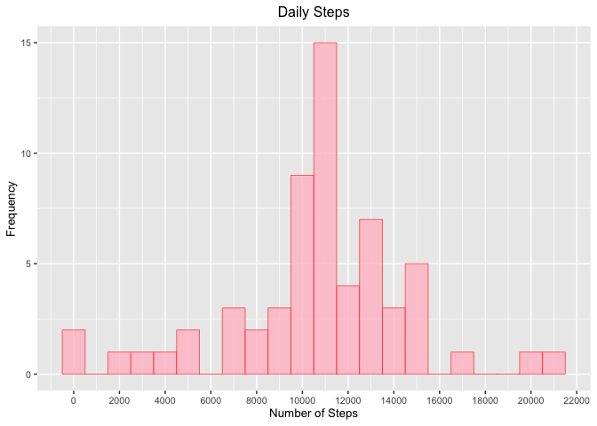

### Reproducible Research - Peer Assessment 1:
*Author: Alexander M Fisher*

#### Introduction:

This is the first project in the Reproducible Research module in the data science specialisation run by John Hopkins.The data for this project can be downloaded via the link provided in the course or alternatively by using the following link [Activity Data](https://d396qusza40orc.cloudfront.net/repdata%2Fdata%2Factivity.zip) [52K].  

The variables included in this dataset are (information provided from coursera website):

- steps: Number of steps taking in a 5-minute interval (missing values are coded as \color{red}{\verb|NA|}NA)
- date: The date on which the measurement was taken in YYYY-MM-DD format
- interval: Identifier for the 5-minute interval in which measurement was taken
- The dataset is stored in a comma-separated-value (CSV) file and there are a total of 17,568 observations in this dataset.

*for more information about the data set and/or project please go to reproducible_research project's [github repo](http://github.com/rdpeng/RepData_PeerAssessment1) * 

**********
#### Loading and preprocessing the data

In this section the data will be downloaded if `activity.csv` is not present in the working directory, unzipped and loaded. 


```r
# Download Data if not already in working directory:
if (!file.exists("activity.csv")){
        file_url <- "https://d396qusza40orc.cloudfront.net/repdata%2Fdata%2Factivity.zip" 
        download.file(file_url, destfile = paste0(getwd(), "/repdata_data_activity.zip"), method = "curl")
        unzip("repdata_data_activity.zip")
}

# Load Data:
activity_data <- read.csv("activity.csv", colClasses=c("numeric", "Date", "numeric"))
```

Lets have a quick look at the data. Here i will call `head()`, in other instances you may want to use `dim` or `str` aswell.


```r
head(activity_data)
```

```
##   steps       date interval
## 1    NA 2012-10-01        0
## 2    NA 2012-10-01        5
## 3    NA 2012-10-01       10
## 4    NA 2012-10-01       15
## 5    NA 2012-10-01       20
## 6    NA 2012-10-01       25
```


**********
#### What is mean total number of steps taken per day?

Data is sorted by date (i.e the steps are summed over each day/date). Note that `na.rm =  TRUE` is used to ignore all cases where `NA` is observed. 

```r
steps_per_day <- aggregate(data = activity_data,steps~date,FUN = sum, na.rm = TRUE)
```

Now to make a histogram of the total number of steps taken each day.

```r
library(ggplot2)
ggplot(steps_per_day, aes(x = steps)) +
        geom_histogram(col = "red", fill = "pink", alpha = 0.8, binwidth = 1000, size=0.2) +
        scale_x_continuous(breaks = scales::pretty_breaks(n = 10)) +
        labs(title = "Daily Steps", x = "Number of Steps", y = "Frequency") + 
        theme(plot.title = element_text(hjust = 0.5),text = element_text(size=10))
```

<!-- -->

Next is to calculate and report the mean and median of the total number of steps taken per day. This will be done using the `summarise()` function from the `dplyr` package. The two summary statistics will be named `mean_steps_per_day` and `median_steps_per_day` and stored in data.table `summary`.


```r
library(dplyr)
summary = summarise(steps_per_day, mean_steps_per_day = mean(steps), 
                    median_steps_per_day = median(steps)) 

# lets take a look inside summary:
summary
```

```
##   mean_steps_per_day median_steps_per_day
## 1           10766.19                10765
```

So from this we can see that the mean number of steps taken per day is `10766.19`, and the median number of steps is `10765`.

**********
#### What is the average daily activity pattern?

First `steps_per_interval` is created by taking the mean number of steps for each interval.

```r
steps_per_interval <- aggregate(data = activity_data,steps~interval,FUN = mean, na.rm = TRUE)
```

This result can now be plotted on a line type plot.

```r
ggplot(steps_per_interval, aes(x = interval, y = steps)) +
        geom_line(color= "pink", size=1, alpha=0.9, linetype=1) +
        labs(title = "Daily Steps", x = "Interval", y = "Steps")
```

<!-- -->

**********
#### Imputing missing values

There are missing values in this data set. Lets have a look at where they are.


```r
data.frame(na_in_steps = sum(is.na(activity_data$steps)), na_in_dates = sum(is.na(activity_data$date)),
           na_in_interval = sum(is.na(activity_data$interval)))
```

```
##   na_in_steps na_in_dates na_in_interval
## 1        2304           0              0
```

As you can see all of the NA values are found in the "steps" variable. There is a total of 2304 missing values. 

Lets now create an `imputed_data` data table and then fill in the NA values. To fill in the missing data I have chosen to calculate the mean number of steps for each interval, and then use these values for replacement. This is already calculated in `steps_per_interval`. The missing values are then replaced with the mean for the corresponding interval. 

Lets have a look at the `steps_per_interval` data which will be used to replace the missing values.


```r
head(steps_per_interval, 4) 
```

```
##   interval     steps
## 1        0 1.7169811
## 2        5 0.3396226
## 3       10 0.1320755
## 4       15 0.1509434
```

Here I create `imputed_data` and replace the missing values.


```r
imputed_data <- activity_data
where_na <- which(is.na(activity_data$steps))
for (i in 1:length(where_na)){
        imputed_data$steps[where_na[i]] <- steps_per_interval[steps_per_interval$interval == 
                                                imputed_data$interval[where_na[i]], "steps"]
}
```

Lets have a look at the first few observations of the updated `imputed_data` table. Hopefully the missing values are no longer there and have instead been replaced with the relevant mean values.


```r
head(imputed_data) 
```

```
##       steps       date interval
## 1 1.7169811 2012-10-01        0
## 2 0.3396226 2012-10-01        5
## 3 0.1320755 2012-10-01       10
## 4 0.1509434 2012-10-01       15
## 5 0.0754717 2012-10-01       20
## 6 2.0943396 2012-10-01       25
```

So to recap. The original data set has been copied into `imputed_data` and the missing values have been replaced using the mean number of steps for the respective interval. Now we will create a histogram and visualize the imputed data set. The commands will be similar as to before. 

First the data will need to be sorted by date using the aggregate function as before. This now there is no need for `na.rm =  TRUE` however. 


```r
imputed_steps_per_day <- aggregate(data = imputed_data,steps~date,FUN = sum)
```

Now to make a histogram of the total number of steps taken each day.

```r
library(ggplot2)
ggplot(imputed_steps_per_day, aes(x = steps)) +
        geom_histogram(col = "red", fill = "pink", alpha = 0.8, binwidth = 1000, size=0.2) +
        scale_x_continuous(breaks = scales::pretty_breaks(n = 10)) +
        labs(title = "Daily Steps", x = "Number of Steps", y = "Frequency") + 
        theme(plot.title = element_text(hjust = 0.5),text = element_text(size=10))
```

<!-- -->

Next is to calculate and report the mean and median of the total number of steps taken per day as per before. The two summary statistics again will be named `mean_steps_per_day` and `median_steps_per_day` and stored in data.table `imputed_summary`.


```r
library(dplyr)
imputed_summary = summarise(imputed_steps_per_day, mean_steps_per_day = mean(steps), 
                    median_steps_per_day = median(steps)) 

# lets take a look inside summary:
imputed_summary
```

```
##   mean_steps_per_day median_steps_per_day
## 1           10766.19             10766.19
```

So from this we can see that the mean number of steps taken per day is 10766.19, and the median number of steps is 10766.19.

Lets have a look at the differences in the results on the `activity_data` data set and the `imputed_data` data set.  Firstly I will row bind the summary statistics. 


```r
rbind(summary, imputed_summary)
```

```
##   mean_steps_per_day median_steps_per_day
## 1           10766.19             10765.00
## 2           10766.19             10766.19
```

From this we can see the mean value with regards to number of steps per day is the same and the median value is slightly bigger. In essence the imputed data set has averaged values replacing missing values, and this is seen in minimal impact on the mean between the two sets. This can also be seen in the histogram as the frequency in the middle bin has increased while all the other bins frequency hasn't changed. Lets have a look at this more deeply. First lets see how many values are recorded for each day starting from 1/10 to 30/11. We can see that each day has 288 inputs.  


```r
table(activity_data$date)
```

```
## 
## 2012-10-01 2012-10-02 2012-10-03 2012-10-04 2012-10-05 2012-10-06 2012-10-07 
##        288        288        288        288        288        288        288 
## 2012-10-08 2012-10-09 2012-10-10 2012-10-11 2012-10-12 2012-10-13 2012-10-14 
##        288        288        288        288        288        288        288 
## 2012-10-15 2012-10-16 2012-10-17 2012-10-18 2012-10-19 2012-10-20 2012-10-21 
##        288        288        288        288        288        288        288 
## 2012-10-22 2012-10-23 2012-10-24 2012-10-25 2012-10-26 2012-10-27 2012-10-28 
##        288        288        288        288        288        288        288 
## 2012-10-29 2012-10-30 2012-10-31 2012-11-01 2012-11-02 2012-11-03 2012-11-04 
##        288        288        288        288        288        288        288 
## 2012-11-05 2012-11-06 2012-11-07 2012-11-08 2012-11-09 2012-11-10 2012-11-11 
##        288        288        288        288        288        288        288 
## 2012-11-12 2012-11-13 2012-11-14 2012-11-15 2012-11-16 2012-11-17 2012-11-18 
##        288        288        288        288        288        288        288 
## 2012-11-19 2012-11-20 2012-11-21 2012-11-22 2012-11-23 2012-11-24 2012-11-25 
##        288        288        288        288        288        288        288 
## 2012-11-26 2012-11-27 2012-11-28 2012-11-29 2012-11-30 
##        288        288        288        288        288
```

Now lets have a look at where the missing values are grouped by date. It can be seen that for each day/date there a total of 288 missing inputs. So we can interpret this more generally as the data set is missing a total of 8 days of data.


```r
table(activity_data[is.na(activity_data$steps),]$date)
```

```
## 
## 2012-10-01 2012-10-08 2012-11-01 2012-11-04 2012-11-09 2012-11-10 2012-11-14 
##        288        288        288        288        288        288        288 
## 2012-11-30 
##        288
```

For each of these days, which are made up of 288 inputs/intervals, the missing values have been replaced with the mean steps observed for each interval. The sum total of steps for each day (i.e. sum over the 288 intervals) is a avergae amount. This average amount is observed in the middle of the histogram. It can be seen these 8 days have been added to the middel bar on the histogram. The initial frequency for that bin was 7. Adding the 8 days (i.e. the imputed data) results in the middle bin frequency at a value of 15.

**********
#### Are there differences in activity patterns between weekdays and weekends?

Lets first create a new factor variable called `days`. This will have two factors `weekday` and `weekend` classifying the observation as either being taken on a weekday or weekend. This will allows us to compare the activity (i.e. number of steps) observed on either the weekends or weekdays.  


```r
imputed_data$days <- weekdays(imputed_data$date)
for (i in 1:length(imputed_data$days)){
        if (imputed_data$days == "Saturday" || imputed_data$days[i] == "Sunday"){
                imputed_data$days[i] <- "weekend"
        } else {
                imputed_data$days[i] <- "weekday"
        }
}
imputed_data$days <- factor(imputed_data$days)
```

Lets have a look at the data. 


```r
str(imputed_data)
```

```
## 'data.frame':	17568 obs. of  4 variables:
##  $ steps   : num  1.717 0.3396 0.1321 0.1509 0.0755 ...
##  $ date    : Date, format: "2012-10-01" "2012-10-01" ...
##  $ interval: num  0 5 10 15 20 25 30 35 40 45 ...
##  $ days    : Factor w/ 2 levels "weekday","weekend": 1 1 1 1 1 1 1 1 1 1 ...
```

```r
head(imputed_data)
```

```
##       steps       date interval    days
## 1 1.7169811 2012-10-01        0 weekday
## 2 0.3396226 2012-10-01        5 weekday
## 3 0.1320755 2012-10-01       10 weekday
## 4 0.1509434 2012-10-01       15 weekday
## 5 0.0754717 2012-10-01       20 weekday
## 6 2.0943396 2012-10-01       25 weekday
```

Now to make some plots. First to group the data correctly by factor variable days.


```r
weekday_day <- aggregate(data = imputed_data, steps~interval+days, FUN = mean)
```

Now to make the plot, faceted by days variable.

```r
ggplot(weekday_day, aes(x = interval, y = steps)) +
        geom_line(color= "pink", size=0.7, alpha=1, linetype=1) +
        facet_wrap(~days,ncol=1) +
labs(title = "Daily Steps", x = "Interval", y = "Steps")
```

<!-- -->


