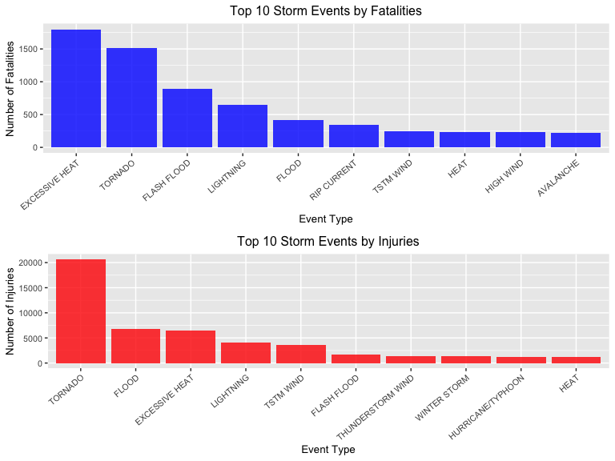
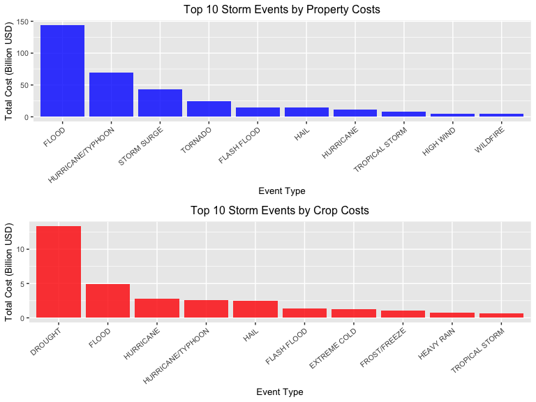

## Reproducible Research - Peer Assessment 2:
(rename title for rpubs submission to something more approriate and add more detail on analysis in synopsis)

*Author: Alexander M Fisher*

### Synopsis:

This is the second project in the data science specialisation course module Reproducible Research. The goal of the anaysis in this porject is to explore the NOAA Storm Database and answer some basic questions about severe weather events. 

The two questions that are of interest are:

1. Across the United States, which types of events (as indicated in the \color{red}{\verb|EVTYPE|}EVTYPE variable) are most harmful with respect to population health?
2. Across the United States, which types of events have the greatest economic consequences?

The analysis shows the damage on health population with regards to two factors, injuries and fatalities. The top ten are taken for each type and displayed in a bar chart. With regards to the economic health the damage for property and crop costs are displayed. The graphs will help the reader visualize which storm events are most damaging. The steps taken in loading and processing the data as well as producing the results have all been documented. 

**********

### Data Processing:

#### Data:

The data that will be used can be downloaded from the following 'Storm_Data' link below. Accompanying the data set is some documentation where you can find how some of the variables are constructed/defined. That can also be downloaded from the 'Documentation' link.

- [Storm_Data](https://d396qusza40orc.cloudfront.net/repdata%2Fdata%2FStormData.csv.bz2) [47Mb]
- [Documentation](https://d396qusza40orc.cloudfront.net/repdata%2Fpeer2_doc%2Fpd01016005curr.pdf)


#### Loading Data:

First the data will downloaded into the working directory, if necessary, and then loaded into R.


```r
if (!file.exists("repdata_data_StormData.csv")){
        file_url <- "https://d396qusza40orc.cloudfront.net/repdata%2Fdata%2FStormData.csv.bz2"
        download.file(file_url, destfile = paste0(getwd(), "/repdata_data_StormData.csv"), method = "curl")
}

storm_data <- read.csv(file.path(getwd(), "repdata_data_StormData.csv"), header = TRUE)
```

Lets have a quick look at the data using `str()`.


```r
str(storm_data)
```

```
## 'data.frame':	902297 obs. of  37 variables:
##  $ STATE__   : num  1 1 1 1 1 1 1 1 1 1 ...
##  $ BGN_DATE  : chr  "4/18/1950 0:00:00" "4/18/1950 0:00:00" "2/20/1951 0:00:00" "6/8/1951 0:00:00" ...
##  $ BGN_TIME  : chr  "0130" "0145" "1600" "0900" ...
##  $ TIME_ZONE : chr  "CST" "CST" "CST" "CST" ...
##  $ COUNTY    : num  97 3 57 89 43 77 9 123 125 57 ...
##  $ COUNTYNAME: chr  "MOBILE" "BALDWIN" "FAYETTE" "MADISON" ...
##  $ STATE     : chr  "AL" "AL" "AL" "AL" ...
##  $ EVTYPE    : chr  "TORNADO" "TORNADO" "TORNADO" "TORNADO" ...
##  $ BGN_RANGE : num  0 0 0 0 0 0 0 0 0 0 ...
##  $ BGN_AZI   : chr  "" "" "" "" ...
##  $ BGN_LOCATI: chr  "" "" "" "" ...
##  $ END_DATE  : chr  "" "" "" "" ...
##  $ END_TIME  : chr  "" "" "" "" ...
##  $ COUNTY_END: num  0 0 0 0 0 0 0 0 0 0 ...
##  $ COUNTYENDN: logi  NA NA NA NA NA NA ...
##  $ END_RANGE : num  0 0 0 0 0 0 0 0 0 0 ...
##  $ END_AZI   : chr  "" "" "" "" ...
##  $ END_LOCATI: chr  "" "" "" "" ...
##  $ LENGTH    : num  14 2 0.1 0 0 1.5 1.5 0 3.3 2.3 ...
##  $ WIDTH     : num  100 150 123 100 150 177 33 33 100 100 ...
##  $ F         : int  3 2 2 2 2 2 2 1 3 3 ...
##  $ MAG       : num  0 0 0 0 0 0 0 0 0 0 ...
##  $ FATALITIES: num  0 0 0 0 0 0 0 0 1 0 ...
##  $ INJURIES  : num  15 0 2 2 2 6 1 0 14 0 ...
##  $ PROPDMG   : num  25 2.5 25 2.5 2.5 2.5 2.5 2.5 25 25 ...
##  $ PROPDMGEXP: chr  "K" "K" "K" "K" ...
##  $ CROPDMG   : num  0 0 0 0 0 0 0 0 0 0 ...
##  $ CROPDMGEXP: chr  "" "" "" "" ...
##  $ WFO       : chr  "" "" "" "" ...
##  $ STATEOFFIC: chr  "" "" "" "" ...
##  $ ZONENAMES : chr  "" "" "" "" ...
##  $ LATITUDE  : num  3040 3042 3340 3458 3412 ...
##  $ LONGITUDE : num  8812 8755 8742 8626 8642 ...
##  $ LATITUDE_E: num  3051 0 0 0 0 ...
##  $ LONGITUDE_: num  8806 0 0 0 0 ...
##  $ REMARKS   : chr  "" "" "" "" ...
##  $ REFNUM    : num  1 2 3 4 5 6 7 8 9 10 ...
```

#### Cleaning and Subsetting Relevant Data: 

Lets take a deeper look as to when the majority of the data has been observed. We can expect that as the years progress, better data collection and records will result more observations recorded each year. The data has been binned by date using the cut function. A range of 5 yrs will be suffice to see how data collection (number of observations) evolves over time. The steps taken in the following code chunk are briefly outlined below.

- Format `BGN_DATE` column from character to Date type.
- create a breaks vector for cutting/grouping data later starting from first observed year
 incrementing in 5 yrs to 2015.
- initialize tags vector and fill in with year brackets formatted "[year-year+5)"
- cut data and added resulting factor variable to storm_data
- view results

It can be seen quite clearly that as the years progress, more data is indeed observed and recorded.


```r
storm_data$BGN_DATE <- as.Date(storm_data$BGN_DATE, format = "%m/%d/%Y")
breaks <- seq(from = as.numeric(format(min(storm_data$BGN_DATE),"%Y")), to = 2015 , by = 5)
tags <- vector()
for (year in breaks){tags <- c(tags,paste0("[", year,"-", year+5,")"))}
tags <- tags[-length(tags)]
storm_data$group <- cut(as.numeric(format(storm_data$BGN_DATE, "%Y")), breaks=breaks, include.lowest=TRUE, right=FALSE, labels=tags)

summary(storm_data$group)
```

```
## [1950-1955) [1955-1960) [1960-1965) [1965-1970) [1970-1975) [1975-1980) 
##        1865        9326       10896       14169       18703       20407 
## [1980-1985) [1985-1990) [1990-1995) [1995-2000) [2000-2005) [2005-2010) 
##       33452       41739       70240      158337      184841      227987 
## [2010-2015) 
##      110335
```

There is a lot of useful information provided in the documentation and also from the data providers website [NOAA](https://www.ncdc.noaa.gov/stormevents/details.jsp) . The variables are defined in the documentation [NATIONAL WEATHER SERVICE INSTRUCTION 10-1605 Documentation](https://d396qusza40orc.cloudfront.net/repdata%2Fpeer2_doc%2Fpd01016005curr.pdf). According to NOAA due to changes in the data collection and processing procedures over time, there are unique periods of record available depending on the event type. These are,

- Tornado: From 1950 through 1954, only tornado events were recorded.
- Tornado, Thunderstorm Wind and Hail: From 1955 through 1992, only tornado, thunderstorm wind and hail events were keyed from the paper publications into digital data.
- All Event Types (48 from Directive 10-1605): From 1996 to present, 48 event types are recorded as defined in [NWS Directive 10-1605](https://www.ncdc.noaa.gov/stormevents/pd01016005curr.pdf).

For the purposes of the analysis to follow to allow, for a fairer comparison between event types, only data from 1996 onward will be used. This keep the majority of data as evidenced by the above summary and will allow for a more even representation of event types when investigating frequency, total damage and economic damage.  

In addition to sub-setting by date, only relevant columns relating to event type, fatalities, injuries, damage costs will be kept. Below is a list briefly outlining the steps taken in preparation for the analysis.

- subset data by dates > 1996, and only keep relevant columns.
- keep only observations where at least some damage or fatality or injury was recorded (i.e. >0)  
- reformat the `PROPDMGEXP` and `CROPDMGEXP` columns. E.g. K to 1000 that is character to integer format.  


```r
relevant_cols <- c("EVTYPE","FATALITIES","INJURIES","PROPDMG","PROPDMGEXP","CROPDMG","CROPDMGEXP")
sub_data <- subset(storm_data, BGN_DATE > as.Date("1996-01-01"), select = relevant_cols)
sub_data <- subset(sub_data,(FATALITIES > 0 | INJURIES > 0 | PROPDMG > 0 | CROPDMG > 0 ))

KEY = c("K" = 10^3, "M" = 10^6, "B" = 10^9)
sub_data$PROPDMGEXP <- KEY[sub_data$PROPDMGEXP]
sub_data[is.na(sub_data$PROPDMGEXP),"PROPDMGEXP"] <- 10^0
sub_data$CROPDMGEXP <- KEY[sub_data$CROPDMGEXP]
sub_data[is.na(sub_data$CROPDMGEXP),"CROPDMGEXP"] <- 10^0
```

To complete the initial stages of data processing the crop costs and property costs will
be calculated by multiplying the relevant dmg col with the exp col to get the absolute (numerical) figure in usd. See the code chunk below.


```r
# calculate costs
sub_data$PROPCOST <- sub_data$PROPDMG * sub_data$PROPDMGEXP
sub_data$CROPCOST <- sub_data$CROPDMG * sub_data$CROPDMGEXP
```


#### Generating `health_data`:

In this section the `sub_data` will be further processed to generate `health_data`. This data table will be grouped by 'damage type' i.e. fatality or injury as well as event type. It will contain the top ten events for each damage type. The steps taken in the data manipulation process is listed below. 

- generate `health_data` by selecting relevant cols. `c("EVTYPE", "FATALITIES", "INJURIES")`.
- melt data table to have a column `damage_type` specifying fatality or injury and only one count column named `value`.
- aggregate the count by summing over all event types and damage_type.
- order by `damage_type` and `value` in decreasing value, and take top 10 in each group (i.e each damage_type).


```r
health_data <- subset(sub_data, select = c("EVTYPE", "FATALITIES", "INJURIES"))
health_data <- reshape2::melt(health_data,id.vars="EVTYPE", variable.name = "damage_type")
health_data <- aggregate(data = health_data, value ~ EVTYPE + damage_type, FUN = sum)
health_data <- data.table::setDT(health_data)[order(damage_type,-value),.SD[1:10], by=damage_type]
```

Lets take a look at the resulting data. Lets print out first 15 elements, i.e. the top 10 in FATALITIES, and the top 5 in INJURIES


```r
head(health_data,15)
```

```
##     damage_type         EVTYPE value
##  1:  FATALITIES EXCESSIVE HEAT  1797
##  2:  FATALITIES        TORNADO  1511
##  3:  FATALITIES    FLASH FLOOD   887
##  4:  FATALITIES      LIGHTNING   650
##  5:  FATALITIES          FLOOD   414
##  6:  FATALITIES    RIP CURRENT   340
##  7:  FATALITIES      TSTM WIND   241
##  8:  FATALITIES           HEAT   237
##  9:  FATALITIES      HIGH WIND   235
## 10:  FATALITIES      AVALANCHE   223
## 11:    INJURIES        TORNADO 20667
## 12:    INJURIES          FLOOD  6758
## 13:    INJURIES EXCESSIVE HEAT  6391
## 14:    INJURIES      LIGHTNING  4140
## 15:    INJURIES      TSTM WIND  3629
```

#### Generating `econ_data`:

In this section the `sub_data` will be further processed to generate `econ_data`. This data table will be grouped by 'cost type' i.e. property cost (`PROPCOST`) or crop cost (`CROPCOST`) as well as event type. It will contain the top ten events for each cost type. The steps taken in the data manipulation process is listed below. 

- generate `econ_data` by selecting relevant cols. `c("EVTYPE","PROPCOST","CROPCOST")`.
- melt data table to have a column `cost_type` specifying prop cost or crop cost and only one cost (in usd) column named `value`.
- aggregate the count by summing over all event types and cost_type.
- order by `cost_type` and `value` in decreasing value, and take top 10 in each group (i.e each cost_type).


```r
# create econ_data table by groups of cropcost and propcost top 10 events.
econ_data <- subset(sub_data, select = c("EVTYPE","PROPCOST","CROPCOST"))
econ_data <- reshape2::melt(econ_data,id.vars="EVTYPE", variable.name = "cost_type")
econ_data <- aggregate(data = econ_data, value~EVTYPE + cost_type, FUN = sum)
econ_data <- data.table::setDT(econ_data)[order(cost_type,-value),.SD[1:10], by=cost_type]
econ_data$value <- econ_data$value/(10^9)
```

Again lets look at the data.


```r
head(econ_data,15)
```

```
##     cost_type            EVTYPE      value
##  1:  PROPCOST             FLOOD 143.944834
##  2:  PROPCOST HURRICANE/TYPHOON  69.305840
##  3:  PROPCOST       STORM SURGE  43.193536
##  4:  PROPCOST           TORNADO  24.616906
##  5:  PROPCOST       FLASH FLOOD  15.222204
##  6:  PROPCOST              HAIL  14.595143
##  7:  PROPCOST         HURRICANE  11.812819
##  8:  PROPCOST    TROPICAL STORM   7.642476
##  9:  PROPCOST         HIGH WIND   5.247860
## 10:  PROPCOST          WILDFIRE   4.758667
## 11:  CROPCOST           DROUGHT  13.367566
## 12:  CROPCOST             FLOOD   4.974778
## 13:  CROPCOST         HURRICANE   2.741410
## 14:  CROPCOST HURRICANE/TYPHOON   2.607873
## 15:  CROPCOST              HAIL   2.476029
```

That is all for this section. The data is now ready to be plotted in the results section.

**********
### Results:

Now to plot the resulting data tables. In this section ggplot and gripExtra packages have been utilized. In the first plot we will look at 
th health data table. Each damage type will be plotted on it own set of axis. The plots will be a 
bar chart with type of event on the x-axis and total number of incidents, i.e. count of 
fatalities or injuries caused by that specific event for 1996-2011. Please see code chunk for specifics. 


```r
library(ggplot2)
#### Damage to Population Health PLots:
fatalities_plot <- ggplot(health_data[health_data$damage_type == "FATALITIES",], aes(x = reorder(EVTYPE,-value), y = value)) +
        geom_col(fill = "blue", alpha = 0.8, size=0.2) +
        #scale_y_continuous(limit = c(0, 20000)) +
        labs(x="Event Type",y="Number of Fatalities",title="Top 10 Storm Events by Fatalities") +
        theme(plot.title = element_text(hjust = 0.5), text = element_text(size=10), axis.text.x = element_text(angle=40, hjust=1))

injuries_plot <- ggplot(health_data[health_data$damage_type == "INJURIES",], aes(x = reorder(EVTYPE,-value), y = value)) +
        geom_col(fill = "red", alpha = 0.8, size=0.2) + 
        labs(x="Event Type",y="Number of Injuries",title="Top 10 Storm Events by Injuries") +
        theme(plot.title = element_text(hjust = 0.5), text = element_text(size=10), axis.text.x = element_text(angle=40, hjust=1))

gridExtra::grid.arrange(fatalities_plot, injuries_plot, nrow = 2)
```

<!-- -->

The next plot will use the econ data table. This again will have sub plots, for each type of cost, i.e. propcost, and cropcost. 


```r
#### Damage to Economic Health PLots:
propcost_plot <- ggplot(econ_data[econ_data$cost_type == "PROPCOST",], aes(x = reorder(EVTYPE,-value), y = value)) +
        geom_col(fill = "blue", alpha = 0.8, size=0.2) +
        #scale_y_continuous(labels = scales::scientific) +
        labs(x="Event Type",y="Total Cost (Billion USD)",title="Top 10 Storm Events by Property Costs") +
        theme(plot.title = element_text(hjust = 0.5), text = element_text(size=10), axis.text.x = element_text(angle=40, hjust=1))

cropcost_plot <- ggplot(econ_data[econ_data$cost_type == "CROPCOST",], aes(x = reorder(EVTYPE,-value), y = value)) +
        geom_col(fill = "red", alpha = 0.8, size=0.2) + 
        #scale_y_continuous(limits = c(0,1.5*10^11), labels = scales::scientific) +
        labs(x="Event Type",y="Total Cost (Billion USD)",title="Top 10 Storm Events by Crop Costs") +
        theme(plot.title = element_text(hjust = 0.5), text = element_text(size=10), axis.text.x = element_text(angle=40, hjust=1))

gridExtra::grid.arrange(propcost_plot, cropcost_plot, nrow = 2)
```

<!-- -->

#### Discussion:

It can be seen that the number of fatalities is approximately an order of magnitude lower than number of injuries. This is reassuring as we expect a lot more injuries be observed compared to fatalities. I have not kept the axis limits the same on both graphs which doesn't make that necessarily apparent at first glance but this point should be noted. By far the most damaging storm event with regards to population health is Tornado. It is second most damaging in fatalities and quite substantially the most damaging when looking at injuries. Excessive heat is top three for both damage types, and should be noted. 

With regards to economic damage, it is quite clear that property damage is far more costly than crop damage. This is also again to be expected. ALso note that again the axis limits are not the same and make in initial glance the impacts to be of similar magnitude. Crop cost in this instance is an order of magnitude lower than property. Drought and floods are the two most damaging to crops. Floods, Hurricane/Typhoon and storm surges are top three damaging to property.  Overall flood is the most damaging=ng and the one event that may be wise to prepare for and put in measures to reduce flooding impacts on property. Please have a look at how the data has been recorder and when certain events were regularly updated and accurately, as the data collection may have unexpected or biasing effect in the results. Overall however, this is a good start to the analysis of this data set and the results seem sensible.


*************


